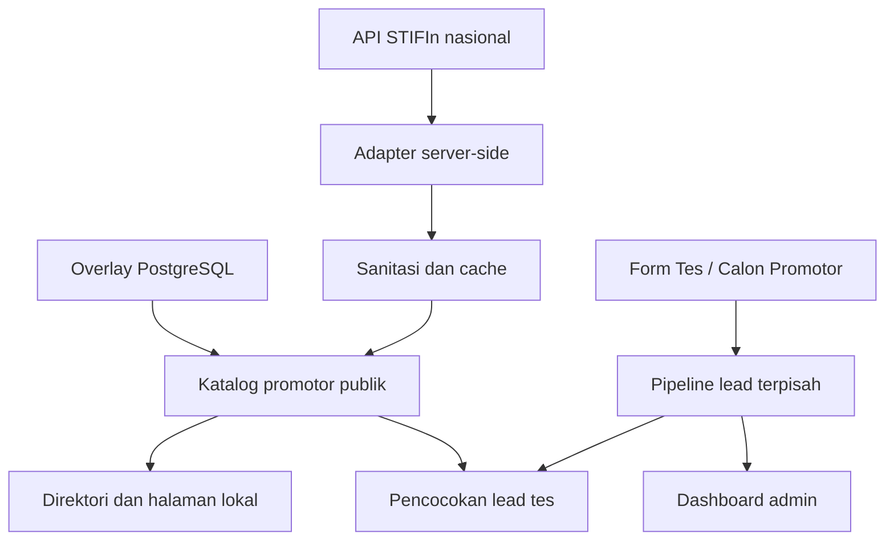

# Promotor Nasional, Dua Funnel Lead, dan Local SEO - Design

**Tanggal:** 29 Agustus 2026
**Status:** Disetujui untuk direncanakan
**Repository dasar:** `muhamadsofyanar/konsepstifin-platform` commit `6e486d15239efead3fede43824fd92e8b2e5deff`

## Tujuan

Memperbaiki `konsepstifin.com` agar dapat membaca daftar promotor nasional secara benar, menampilkan seluruh promotor aktif tanpa membocorkan data pribadi, menangkap lead Tes STIFIn dan calon promotor melalui jalur yang terpisah, serta hanya mengindeks halaman lokal yang mempunyai cakupan nyata.

## Batas Sistem

- `konsepstifin.com` menangani website publik, direktori promotor, halaman lokal, formulir lead, dashboard operasional, artikel, katalog, dan pencatatan sumber kampanye.
- `app.konsepstifin.com` tetap menangani checkout SEJOLI, member area, dan affiliate. Source WordPress atau plugin SEJOLI tidak diubah dalam pekerjaan ini.
- Plugin `sejoli-stifin-voucher` hanya menjadi referensi kontrak API STIFIn. Website utama tidak bergantung pada runtime plugin tersebut.
- Materi dalam `KIRIM AI.zip` hanya menjadi referensi pola copywriting. Materi itu bukan sumber fakta STIFIn.
- Source implementasi adalah repository produksi pada commit yang disebutkan di atas. ZIP v0.4.1 hanya menjadi pembanding.

## Pendekatan yang Dipilih

Next.js membaca endpoint nasional STIFIn secara server-side, menyaring respons ke bentuk publik, menyimpan hasil pada cache terkontrol, lalu menggabungkannya dengan overlay pemetaan PostgreSQL. Mode cabang tetap tersedia untuk pengujian atau operasi terbatas, tetapi mode nasional tidak boleh membutuhkan daftar cabang.

Pendekatan ini dipilih dibanding dua alternatif:

1. Proxy melalui plugin WordPress ditolak karena membuat website utama bergantung pada ketersediaan `app.konsepstifin.com` dan mencampur tanggung jawab voucher dengan direktori publik.
2. Snapshot permanen sebagai sumber utama ditolak karena cepat kedaluwarsa. Snapshot cache boleh dipakai sebagai stale fallback, tetapi API nasional tetap menjadi sumber utama.

## Arsitektur



## Sumber dan Konfigurasi Promotor

### Mode nasional

Konfigurasi produksi:

```env
STIFIN_API_BASE=https://apro.stifin.id/api
STIFIN_PROMOTER_MODE=national
STIFIN_PROMOTER_NATIONAL_PATH=/proGet/pro/PRO
STIFIN_API_TIMEOUT_MS=15000
```

`STIFIN_PROMOTER_NATIONAL_PATH` boleh berupa path relatif atau URL HTTPS absolut. URL absolut harus menggunakan origin yang diizinkan melalui konfigurasi server; redirect lintas origin ditolak. Header autentikasi opsional tetap dibaca dari environment dan tidak pernah dikirim ke browser.

### Mode cabang

Mode cabang memakai `STIFIN_PROMOTER_MODE=branch` serta `STIFIN_BRANCH_CODE` atau `STIFIN_BRANCH_CODES`. Mode ini memanggil `/proGetCab/pro/{kode}` dan tidak mengubah perilaku endpoint nasional.

### Mode manual

`STIFIN_PROMOTERS_JSON` tetap tersedia sebagai fallback operasional terbatas. Data manual melewati sanitizer yang sama dengan data upstream.

### Cache dan kegagalan upstream

- Fresh cache: 15 menit.
- Stale fallback: maksimal 24 jam sejak sinkronisasi berhasil terakhir.
- Timeout default: 15 detik, dapat dikonfigurasi dalam rentang 5-60 detik.
- Respons dibatasi maksimal 10.000 baris dan ukuran body yang wajar.
- Jika upstream gagal dan stale cache tersedia, website menampilkan stale cache dengan status admin yang jelas.
- Jika upstream gagal tanpa cache, API publik mengembalikan `502`; halaman publik menampilkan kondisi sementara tanpa menyatakan jumlah `0` sebagai data valid.
- Kesalahan bentuk respons, HTTP, timeout, dan konfigurasi harus dapat dibedakan pada dashboard admin tanpa membocorkan token atau payload mentah.

## Model Data Publik Promotor

Hanya field berikut yang boleh keluar dari adapter:

```ts
type PublicPromoter = {
  code: string;
  name: string;
  branchCode: string;
  area: string;
  province: string;
  active: boolean;
  regionCodes: string[];
  mappingSource: 'automatic' | 'manual' | 'unresolved';
};
```

Field email, telepon, tanggal lahir, PassID, saldo voucher, saldo free, alamat pribadi, identitas akun, riwayat transaksi, dan seluruh kolom upstream lain harus dibuang sebelum cache publik dibuat. `menerimaKunjungan` tidak boleh diasumsikan `true` karena API yang diaudit tidak memberikan persetujuan tersebut. UI menggunakan teks netral “Jadwal berdasarkan konfirmasi”.

Seluruh promotor aktif dapat ditemukan di direktori. Promotor nonaktif hanya masuk metrik admin dan tidak tampil di halaman publik, pencocokan lead, atau sitemap.

## Penyatuan Implementasi

Saat ini `src/lib/promoter-source.ts` dan `src/lib/promoter-store.ts` memiliki kontrak dan perilaku berbeda. Implementasi akhir memakai pembagian berikut:

- `promoter-domain.ts`: tipe, sanitizer, normalisasi, pencocokan, dan aturan cakupan murni.
- `promoter-source.ts`: konfigurasi, fetch upstream, pembatasan respons, cache, stale fallback, dan status sinkronisasi.
- `promoter-store.ts`: overlay PostgreSQL, pemetaan wilayah, query direktori, serta API yang dipakai route dan halaman.

Tidak boleh ada fetch upstream kedua di `promoter-store.ts`. Semua consumer membaca satu kontrak yang sama.

## Pemetaan Wilayah

Pemetaan memakai tiga lapisan dengan urutan prioritas:

1. **Manual:** kode Wilayah.id yang disimpan admin di PostgreSQL.
2. **Otomatis:** kecocokan nama area dan provinsi yang sudah dinormalisasi terhadap Wilayah.id.
3. **Belum terselesaikan:** promotor tetap muncul di direktori berdasarkan area/provinsi upstream, tetapi tidak membuat halaman lokal indexable.

Normalisasi harus menangani awalan `Kabupaten`, `Kab.`, dan `Kota`, spasi/tanda baca, kapitalisasi, serta alias DKI Jakarta dan DI Yogyakarta. Kecocokan kabupaten/kota hanya dianggap valid bila provinsinya juga cocok. Bila nama area ambigu atau provinsi kosong, sistem tidak boleh menebak.

Dashboard pemetaan menyediakan:

- pencarian berdasarkan nama, KodeID, cabang, area, provinsi, dan status mapping;
- filter `mapped`, `automatic`, dan `unresolved`;
- edit manual satu promotor;
- impor CSV untuk pembaruan massal dengan kolom `promoter_code,region_codes`;
- validasi seluruh kode wilayah sebelum commit;
- ringkasan jumlah baris diterima, ditolak, dan alasan penolakan;
- ekspor CSV mapping aktif untuk backup operasional.

Impor bersifat upsert dan tidak menghapus mapping yang tidak disebutkan. Penghapusan massal tidak termasuk scope.

## Direktori Publik

Route `/promotor` menampilkan semua promotor aktif melalui pencarian dan pagination server-side, bukan merender ribuan kartu sekaligus.

Fitur direktori:

- pencarian nama atau KodeID;
- filter provinsi, kabupaten/kota, dan cabang;
- pagination dengan batas 24 item per halaman;
- jumlah hasil dan status pembaruan;
- kartu berisi nama, KodeID, cabang, area/provinsi, dan status jadwal berdasarkan konfirmasi;
- CTA ke formulir Tes STIFIn dengan wilayah terisi bila tersedia;
- tidak ada tautan kontak langsung.

Query yang tidak valid dikembalikan ke nilai aman. Halaman hasil filter menggunakan canonical ke `/promotor` dan `noindex, follow` untuk mencegah kombinasi parameter menjadi halaman indeks baru.

Profil individual promotor tidak dibuat dalam tahap ini. Ribuan profil dengan isi tipis akan menciptakan risiko kualitas SEO dan tidak mempunyai bukti lokal yang cukup.

## Halaman Lokal dan SEO

### Route utama

- `/tes-stifin/[kota]` untuk intent layanan Tes STIFIn.
- `/promotor-stifin/[kota]` untuk intent pencarian promotor.
- `/wilayah/...` tetap menjadi navigasi administratif, tetapi canonical kota diarahkan ke route intent yang sesuai bila halaman intent tersedia.

### Syarat index

Halaman kota dapat memakai `index, follow` hanya bila:

- terdapat minimal satu promotor aktif yang dipetakan ke kabupaten/kota tersebut; atau
- admin secara eksplisit menandai wilayah sebagai dapat dilayani dengan bukti operasional yang tersimpan.

Selain itu halaman memakai `noindex, follow` dan tidak masuk sitemap. Kecamatan hanya index bila mempunyai mapping langsung. Desa/kelurahan selalu `noindex, follow` pada tahap ini.

### Isi minimum halaman indexable

- nama kota dan provinsi yang valid;
- jumlah promotor aktif;
- daftar promotor yang melayani wilayah;
- jenis layanan yang tersedia dari katalog aktif;
- tanggal pembaruan nyata;
- CTA dengan wilayah terisi;
- FAQ lokal yang menjawab proses, jadwal, privasi kontak, dan tatap muka;
- schema `Service`, `BreadcrumbList`, dan `FAQPage` yang identik dengan isi terlihat.

Nama kota tidak boleh sekadar disisipkan ke template generik tanpa data cakupan. Bukti kegiatan lokal hanya ditampilkan bila admin memasukkan dokumentasi yang benar untuk wilayah tersebut.

### Sitemap dan tanggal pembaruan

- Sitemap wilayah hanya berisi provinsi/kota/kecamatan yang memenuhi syarat index.
- Sitemap promotor individual ditiadakan karena profil individual tidak dibuat.
- `lastModified` berasal dari waktu mapping, perubahan katalog, artikel lokal, atau sinkronisasi upstream terakhir yang relevan.
- Waktu saat sitemap diminta tidak boleh dipakai sebagai `lastModified`.

## Dua Funnel Lead

### Jenis lead

```ts
type LeadType = 'tes' | 'calon_promotor';
```

Form Tes hanya menawarkan layanan Tes Personal, Keluarga, Sekolah/Komunitas, dan bantuan memilih layanan. Form calon promotor hanya menawarkan Preview, WSL 1, WSL 2, ID/alat, paket promotor, dan bantuan memahami tahapan.

Affiliate tetap merupakan funnel terpisah dan tidak digabung dengan dua tipe lead ini.

### Data yang disimpan

- `lead_type`;
- `product_key` dan `service`;
- nama dan nomor WhatsApp;
- provinsi serta kabupaten/kota;
- catatan kebutuhan;
- source path;
- `utm_source`, `utm_medium`, `utm_campaign`, `utm_content`, `utm_term`;
- referrer yang telah dibatasi panjangnya;
- consent kontak dan waktu consent;
- consent berbagi kepada promotor khusus lead tes;
- status pipeline, PIC/assigned code, tenggat respons, dan catatan internal.

Parameter kampanye dibaca dari halaman, divalidasi, dibatasi panjangnya, lalu dikirim bersama form. Nilai itu tidak digunakan untuk membuat redirect bebas atau HTML mentah.

### Consent

- Lead tes wajib menyetujui kontak dan pembagian terbatas kepada promotor yang ditugaskan.
- Calon promotor wajib menyetujui kontak oleh tim, tetapi tidak dipaksa menyetujui pembagian kepada promotor layanan tes.
- Data sidik jari, password, dokumen identitas, atau informasi rahasia tidak boleh diminta.

### Pipeline

Lead tes memakai status:

`baru -> mencari_promotor -> ditawarkan -> diklaim -> dijadwalkan -> selesai/ditutup`

Calon promotor memakai status:

`baru -> dihubungi -> konsultasi -> mengikuti_preview -> mengikuti_wsl -> aktivasi -> selesai/ditutup`

Status disimpan sebagai nilai tervalidasi sesuai tipe lead. Perubahan status selalu menghasilkan history event.

### Pencocokan

Hanya lead tes yang dicocokkan otomatis ke promotor. Prioritas pencocokan:

1. mapping manual paling spesifik;
2. mapping otomatis kabupaten/kota;
3. kecocokan provinsi;
4. tidak ada kandidat.

Calon promotor masuk antrean rekrutmen dan tidak otomatis dibagikan kepada promotor publik. Admin dapat menentukan PIC secara manual.

## Dashboard Lead

Dashboard `/admin/leads` menambahkan:

- tab Tes dan Calon Promotor;
- filter status, provinsi, kabupaten/kota, layanan, sumber kampanye, dan rentang tanggal;
- pencarian nama, WhatsApp, atau nomor referensi;
- kandidat promotor untuk lead tes;
- PIC untuk calon promotor;
- detail UTM dan riwayat status;
- metrik jumlah baru, terlambat ditindaklanjuti, terjadwal/aktivasi, selesai, dan ditutup.

Nomor WhatsApp hanya terlihat setelah login admin. Endpoint admin tetap memakai autentikasi yang sudah ada.

## Copywriting

Materi `KIRIM AI.zip` diterapkan sebagai pola, bukan salinan:

1. Headline harus menghentikan perhatian, membangun rasa ingin tahu, dan menyaring audiens yang tepat.
2. Kartu layanan menjelaskan fitur, manfaat, lalu kaitannya dengan situasi nyata audiens.
3. Setiap funnel mempunyai satu CTA utama dan satu CTA sekunder yang tidak bersaing.
4. Paragraf pendek, subjudul spesifik, dan objection handling dipakai untuk memudahkan pemindaian halaman.
5. Formula statistik, kelangkaan, urgensi, testimoni, jaminan hasil, klaim kesehatan, klaim penghasilan, dan klaim superioritas hanya boleh dipakai bila tersedia bukti yang dapat diverifikasi.
6. Bahasa publik membedakan hasil tes, edukasi, dan layanan dari diagnosis medis atau kepastian masa depan.

Copy utama akan difokuskan pada tiga kebutuhan nyata:

- memahami proses Tes STIFIn dan menemukan layanan terdekat;
- memilih layanan berdasarkan kebutuhan personal, keluarga, atau institusi;
- memahami tahapan calon promotor sebelum melakukan checkout.

## API Publik dan Admin

### Publik

- `GET /api/promotor?q=&province=&regency=&branch=&page=` mengembalikan data aman dan pagination.
- Metadata publik hanya memuat jumlah hasil, halaman, ukuran halaman, serta waktu data diperbarui.
- Detail konfigurasi, daftar kegagalan branch, URL upstream, dan status auth tidak ditampilkan pada API publik.

### Admin

- endpoint status sumber menampilkan mode, hasil HTTP terakhir, jumlah total/aktif/nonaktif, jumlah cabang, jumlah mapped/unresolved, waktu sinkronisasi, penggunaan stale cache, dan pesan kesalahan yang sudah disanitasi;
- endpoint impor mapping menerima CSV berukuran terbatas dan hanya dapat dipanggil admin;
- endpoint mapping individual tetap tersedia dengan validasi KodeID dan Wilayah.id.

## Migrasi Database

Migrasi dilakukan idempotent melalui `CREATE TABLE IF NOT EXISTS` dan `ALTER TABLE ... ADD COLUMN IF NOT EXISTS`, mengikuti pola repository.

Perubahan utama:

- menambah `lead_type`, `product_key`, UTM, referrer, PIC, dan metadata pencocokan pada `public_interest_leads`;
- memperluas validasi status tanpa menghapus data status lama;
- menambah `mapping_source` dan `updated_at` pada overlay mapping bila diperlukan;
- menambah tabel kecil untuk status wilayah yang dapat dilayani secara manual dan waktu pembaruan;
- mempertahankan seluruh lead, mapping, produk, dan artikel lama.

Backfill menetapkan tipe lead berdasarkan layanan lama: layanan promotor menjadi `calon_promotor`, sisanya menjadi `tes`. Nilai yang tidak dikenali masuk `tes` dengan penanda catatan migrasi untuk audit admin.

## Keamanan dan Privasi

- Fetch STIFIn hanya terjadi di server.
- Secret hanya berasal dari environment.
- Semua respons upstream diperlakukan tidak tepercaya.
- Sanitasi menggunakan allowlist field; bukan blacklist.
- Endpoint publik diberi rate limit dan cache yang sesuai.
- Form lead mempertahankan honeypot, minimum submit time, validasi telepon, batas panjang, dan rate limit.
- Filter atau pencarian tidak boleh menghasilkan SQL string interpolation.
- CSV mencegah formula injection saat diekspor dan menolak baris berukuran tidak wajar.
- Log tidak boleh menuliskan payload PII atau header autentikasi.

## Observabilitas

Status sumber promotor harus menjawab:

- apakah konfigurasi valid;
- endpoint mode yang dipakai;
- kapan sinkronisasi berhasil terakhir;
- jumlah baris mentah, aman, aktif, nonaktif, mapped, dan unresolved;
- apakah data berasal dari fresh cache atau stale fallback;
- kategori kegagalan terakhir.

Healthcheck Docker tetap memeriksa kesehatan aplikasi, bukan memaksa API STIFIn selalu tersedia. Gangguan upstream tidak boleh menggagalkan rolling deployment bila aplikasi dan stale cache masih dapat melayani halaman.

## Pengujian

### Unit

- sanitizer hanya menghasilkan allowlist field dan membuang PII;
- parser menerima struktur `data` yang valid dan menolak struktur tidak dikenal;
- mode national dan branch menghasilkan URL yang tepat;
- fresh cache dan stale fallback bekerja sesuai durasi;
- normalisasi wilayah menangani alias dan menolak kecocokan ambigu;
- pagination, filter, dan search deterministik;
- validasi lead berbeda untuk Tes dan Calon Promotor;
- status pipeline ditolak bila tidak sesuai tipe lead;
- sitemap hanya memuat wilayah yang memenuhi syarat;
- `lastModified` tidak berubah hanya karena sitemap diminta kembali.

### Integrasi

- overlay PostgreSQL mengalahkan mapping otomatis;
- impor CSV melakukan upsert dan melaporkan baris ditolak;
- migrasi lead lama tidak menghapus data;
- formulir menyimpan UTM, consent, dan history;
- endpoint publik tidak mengandung field PII.

### UI dan build

- direktori dapat dicari dan dipaginasi pada desktop serta mobile;
- form Tes dan Calon Promotor menampilkan layanan dan consent yang benar;
- dashboard memisahkan dua pipeline;
- halaman lokal kosong memiliki `noindex` dan tidak masuk sitemap;
- `npm test`, `npm run lint`, pemeriksaan TypeScript, `npm run build`, dan healthcheck Docker lulus.

## Kriteria Selesai

Pekerjaan dianggap selesai bila:

1. Mode nasional mengembalikan data aktif dari endpoint nasional dan tidak membutuhkan kode cabang.
2. Tidak ada PII upstream pada API atau HTML publik.
3. Seluruh promotor aktif dapat dicari tanpa merender ribuan kartu sekaligus.
4. Lead Tes dan Calon Promotor tersimpan, tervalidasi, dan dikelola dalam pipeline terpisah.
5. Hanya wilayah dengan cakupan nyata yang masuk sitemap dan index.
6. Dashboard menunjukkan kesehatan sinkronisasi dan unresolved mapping secara jelas.
7. Copy publik mengikuti pola KIRIM AI tanpa menambahkan klaim yang tidak dapat dibuktikan.
8. Test, lint, typecheck, build, dan healthcheck lulus pada source produksi.

## Di Luar Scope

- Mengubah plugin voucher atau source WordPress/SEJOLI.
- Memindahkan checkout dari `app.konsepstifin.com`.
- Menampilkan kontak pribadi promotor.
- Membuat ribuan profil promotor individual.
- Menambahkan pengiriman WhatsApp otomatis.
- Menjamin ranking Google atau kutipan oleh sistem AI.
- Menghapus data lama secara massal.
